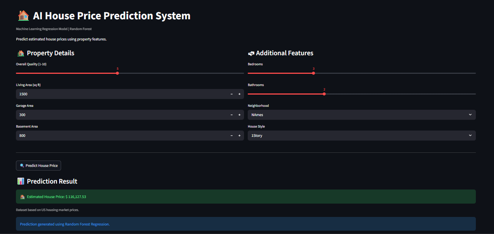
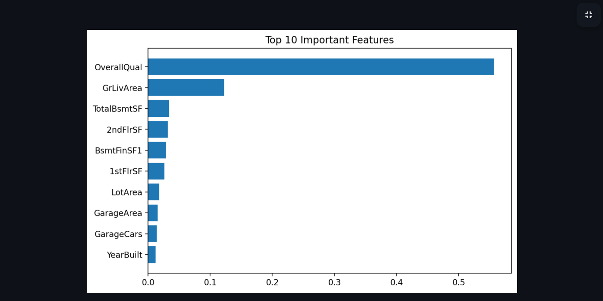

# House Price Prediction App

This a machine learning web application that predicts house prices based on property features such as living area, quality, garage size, and number of bedrooms. Built using Python, Streamlit, and Scikit-learn, and deployed as an interactive web app.

----------------------------------------------------------------------------------------------------------------------

# LIVE DEMO

👉 Paste Your Streamlit Link Here

----------------------------------------------------------------------------------------------------------------------

# PROJECT OVERVIEW

This project uses a **Random Forest Regression model** to estimate house prices using real estate property data.

The application allows users to input house features and instantly receive a predicted house price along with feature importance visualization.

The goal of this project is to demonstrate:
- Machine Learning Regression
- Data preprocessing
- Feature engineering
- Interactive dashboard development
- Model deployment with Streamlit

----------------------------------------------------------------------------------------------------------------------

# FEATURES

- 🏠 Real-time house price prediction
- 📊 Random Forest Regression model
- 📈 Feature importance visualization
- Interactive Streamlit dashboard
- Clean and responsive UI
- Machine learning deployment

----------------------------------------------------------------------------------------------------------------------

# TECH STACK

- Python
- Streamlit
- Pandas
- NumPy
- Scikit-learn
- Matplotlib
- Joblib

----------------------------------------------------------------------------------------------------------------------

# MACHINE LEARNING MODEL

- Algorithm: Random Forest Regressor
- Problem Type: Regression
- Dataset: Ames Housing Dataset (Kaggle)

## Input Features

- Overall Quality
- Living Area
- Garage Area
- Basement Area
- Number of Bedrooms
- Number of Bathrooms
- Neighborhood
- House Style

## Output

- Predicted House Price

----------------------------------------------------------------------------------------------------------------------

# SCREENSHOTS

## Home & Prediction Screen

----------------------------------------------------------------------------------------------------------------------

## Feature Importance Chart

----------------------------------------------------------------------------------------------------------------------

# PROJECT STRUCTURE

house-price-prediction/
│
├── app/
│   └── app.py
│
├── data/
│   └── housing.csv
│
├── models/
│   ├── model.pkl
│   └── features.pkl
│
├── screenshots/
│   ├── Homeprediction.png
│   └── chart.png
│
├── train_model.py
├── requirements.txt
└── README.md

----------------------------------------------------------------------------------------------------------------------

# BUSINESS VALUE

- Helps estimate housing prices using property data
- Demonstrates predictive analytics in real estate
- Supports data-driven pricing decisions
- Showcases regression-based machine learning solutions

----------------------------------------------------------------------------------------------------------------------

# AUTHOR

Craig D Chiambiro

Aspiring Software Engineer / Data Science Enthusiast

Focus Areas:
- Machine Learning
- AI Applications
- Full Stack Development
- Data Analytics

----------------------------------------------------------------------------------------------------------------------

# FUTURE IMPROVEMENTS

- Add advanced visual analytics
- Integrate additional housing datasets
- Add downloadable PDF reports
- Improve UI/UX design
- Deploy with cloud database integration

----------------------------------------------------------------------------------------------------------------------

# DATASET

This project uses the Ames Housing Dataset commonly used for machine learning regression tasks and Kaggle competitions.

----------------------------------------------------------------------------------------------------------------------

# SUPPORT

If you like this project:

⭐ Give it a star on GitHub  
🤝 Connect with me on LinkedIn - Craig Chiambiro